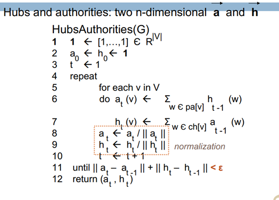
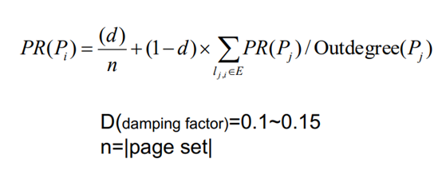
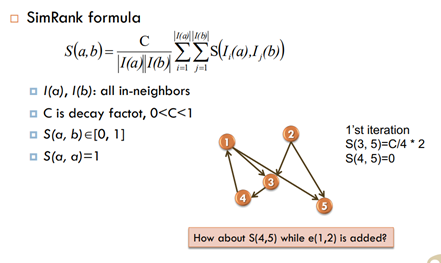

# Link-Analysis

The repo contains three implementations of graph algorithms including:
- HITS
- PageRank
- SimRank


## Environment
```
- Python 3.8.5
- Windows 10
```

## Dataset

- [Graph Data in Txt](./dataset)
- Data Representation:
    - 1, 2 : there's a directional edge from node 1 to node 2
    - 4, 5 : there's a directional edge from node 4 to node 5


## Algorithm implementation
### HITS
```
- Authority = Transpose of Adjacency Matrix  *  Hub
- Hub = Adjacency Matrix * Authority
- L1 Normalization after each iteration
```



### PageRank
```
- Damping Factor set as 0.15
- Initialize each PageRank as 1/n
```



### SimRank


## Result
- Stored in [here](./output_file)
